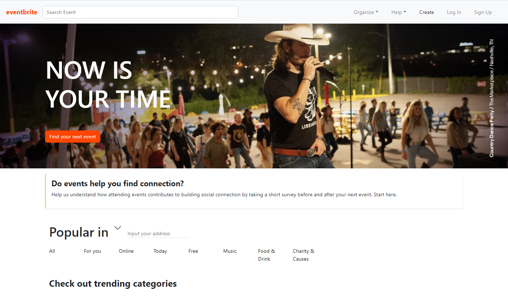
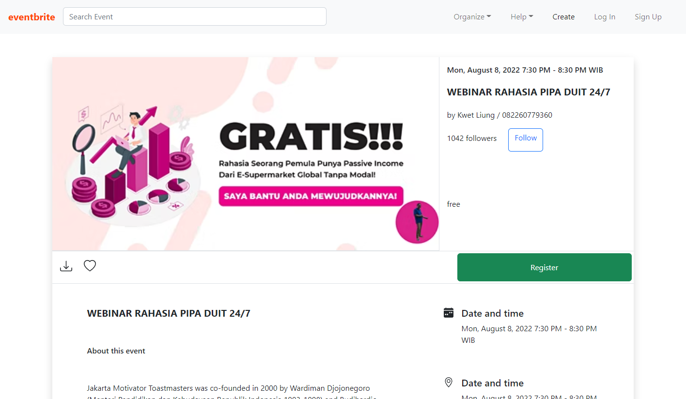

<p align="center">

  <h1 align="center">Eventbrite</h1>

  <p align="center">
    <br />
    <a href="#">View Live Application</a>
    ·
    <a href="#">Report Bug</a>
    ·
    <a href="#">Request Feature</a>
  </p>
</p>

## Table of Contents

-  [About the Project](#about-the-project)
   -  [Built With](#built-with)
-  [Getting Started](#getting-started)
   -  [Installation](#installation)

## About The Project

Eventbrite is the world's largest event technology platform, powering millions of events in more than 180 countries and territories. Eventbrite's search engine optimization (SEO) team began using Event structured data on its website in 2015 to increase the visibility of creator events on the internet. Therefore, Eventbrite was well prepared to participate when Google new experiences in event search on the mobile platform in May 2017.

### Built With

[](https://reactjs.org/)


[](https://getbootstrap.com/)

## Getting Started

### Installation

1. Clone the repo

```
$ git clone https://github.com/elyasprba/eventbrite-kairos.git
```

2. Install NPM packages

```
$ npm install
```

3. Starting application

```sh
$ npm run start
```

5. eventbrite is Running in http://localhost:3000

### Preview

<div style="display:flex, flex-direction: column" >



